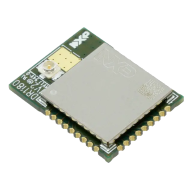
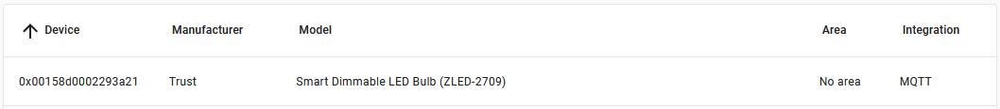
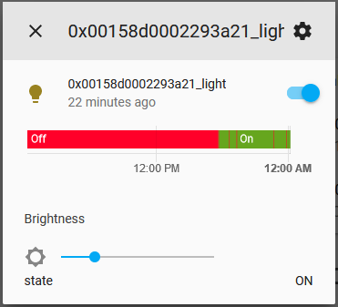

**Unofficial** PlatformIO support for NXP's Jennic ZigBee family of chips (JN516x)

Requires NXP BeyondStudio Toolchain & The Jennic ZigBee SDK.
Note that most of the SDK is pre-compiled and closed-source, but the PlatformIO buildscript handles 
linking the correct libraries and compiling the open source parts.

**This has only been tested on the JN5168 platform with the ZLL DimmableLight example!!**

Non-ZLL ZigBee samples may or may not build, though I have replicated most of the build logic.

## Installation ##

IMPORTANT: This is not compatible with PlatformIO 5.0.0+. Please use 4.3.1 until this is sorted out.

Failure to follow this advice will result in strange linker errors.

### Download Packages from NXP ###

https://www.nxp.com/products/wireless/zigbee/zigbee/zigbee-home-automation:ZIGBEE-HOME-AUTOMATION

- JN-SW-4141 (BeyondStudio)
  [(Direct DL)](https://freescaleesd.flexnetoperations.com/337170/697/13511697/JN-SW-4141.zip)

- JN-SW-4107 (Programmer)
  [(Direct DL)](https://freescaleesd.flexnetoperations.com/337170/587/13660587/JN-SW-4107.zip)

- JN-SW-4168 (ZigBee SDK)
  [(Direct DL)](https://freescaleesd.flexnetoperations.com/337170/187/14928187/JN-SW-4168%20ZigBee-HA-LL%20v2162.zip)

### Extract packages into PlatformIO home ###

1. Extract `JN-SW-4141_BeyondStudio/sdk/Tools/ba-elf-ba2-r36379/` into `$PIOHOME/packages/toolchain-nxp-beyondstudio`

2. Add `package.json`:
``` json
{
    "description": "NXP BeyondStudio",
    "name": "toolchain-nxp-beyondstudio",
    "system": [
        "windows_amd64",
        "windows_x86"
    ],
    "url": "https://www.nxp.com/products/wireless/zigbee/zigbee/zigbee-home-automation:ZIGBEE-HOME-AUTOMATION",
    "version": "1.0.36379"
}
```

3. Extract `JN-SW-4168_SDK` into `$PIOHOME/packages/framework-jennic`

4. Add `package.json`:
``` json
{
    "name": "framework-jennic",
    "description": "Jennic ZigBee SDK for JN51xx chips",
    "url": "https://www.nxp.com/products/wireless/zigbee/zigbee/zigbee-home-automation:ZIGBEE-HOME-AUTOMATION",
    "version": "1.0.1620"
}
```

5. Extract `JN-SW-4107 JN51xx Production Flash Programmer v1614` into `$PIOHOME/packages/tool-jn51prog`

6. Add `package.json`:
``` json
{
    "description": "NXP Flash Programmer for Jennic JN51xx chips",
    "name": "tool-nxp-jn51prog",
    "system": [
        "windows_amd64",
        "windows_x86"
    ],
    "url": "https://www.nxp.com/products/wireless/zigbee/zigbee/zigbee-home-automation:ZIGBEE-HOME-AUTOMATION",
    "version": "1.0.0"
}
```

## Building sample ZLL project ##

Download sample from:

[ZigBee Light Link Solution Application Note (JN-AN-1171)](https://www.nxp.com/docs/en/application-note/JN-AN-1171.zip)

Add platformio.ini to the project root:

``` ini
[platformio]
default_envs = dimmable-light
src_dir = # (Workspace Root)
include_dir = # (Workspace Root)

[env:dimmable-light]
platform = nxp-jennic
framework = jennic
board = jn5168-generic

# Extra build flags required for configuring the platform
conf_target = Light_DimmableLight
conf_zps    = Common\Source\app.zpscfg
conf_os     = Common_Light\Source\App_ZLL_Light_JN516x.oscfgdiag

# Select files to compile
src_filter =
    +<Common/Source>
    +<Common_Light/Source/>
    -<Common_Light/Source/app_ota_client.c>
    -<Common_Light/Source/*_stubs.c>
    -<Common_Light/Source/DriverBulb/>
    +<Common_Light/Source/DriverBulb/DriverBulb_DR1175.c>
    +<Common_Light/Source/DriverBulb/DriverBulb_Shim.c>
    +<Light_DimmableLight/Source/>

# Flags applied only to project source files (not SDK)
src_build_flags =
    -I./Common/Source
    -I./Common_Light/Source
    -I./Common_Light/Source/DriverBulb
    -DLight_DimmableLight
    -DTARGET=Light_DimmableLight

build_flags =
    -I./Light_DimmableLight/Source  # ZCL SDK needs zcl_options.h
    -DBUTTON_MAP_DR1175
    -DDR1175  # DriverBulb driver
    -DDBG_ENABLE
    -DDEBUG_ZCL
    -DDEBUG_APP
    -DDEBUG_START_UP
    -DDEBUG_LIGHT_NODE
    -DDEBUG_LIGHT_TASK
    -DDEBUG_JOIN
    -DDEBUG_COMMISSION
    -DDEBUG_CLASSIC_JOIN
    -DDEBUG_EXCEPTIONS
#    -DDEBUG_TEMPERATURE
#    -DDEBUG_CLD_IDENTIFY
#    -DDEBUG_CLD_LEVEL_CONTROL
#    -DDEBUG_CLD_ONOFF
#    -DDEBUG_LAMP
#    -DDEBUG_CLD_SCENES
#    -DDEBUG_CLD_COLOUR_CONTROL
#    -DDEBUG_CLD_COLOUR_CONTROL_UPDATES
#    -DDEBUG_CLD_COLOUR_CONTROL_CONVERSIONS
#    -DDEBUG_CLD_GROUPS
#    -DDEBUG_APP_OTA
#    -DHALT_ON_EXCEPTION
#    -DRGB  # For RGB targets
```

Add your encryption keys 😉

```
Common_Light/Source/zpr_light_node.c : s_au8ZllLnkKeyArray[]
Common_Light/Source/app_light_commission_task.c : sMasterKey[], ZLL_SUPPORTED_KEYS
Common_Controller/Source/app_remote_comission_task.c : sMasterKey[], ZLL_SUPPORTED_KEYS
```

Compile with PlatformIO:

```
> pio run
CONFIGURATION: https://docs.platformio.org/page/boards/nxp-jennic/jn5168-generic.html
PLATFORM: NXP Jennic ZigBee Platform 1.0.1620 > JN5168 Generic Module
HARDWARE: JN5168 32KB RAM, 256KB Flash
PACKAGES: 
 - framework-jennic 1.0.1620 
 - tool-nxp-jn51prog 1.0.0
 - toolchain-nxp-beyondstudio 1.0.36379
Conf Target: Light_DimmableLight
Conf ZPS:    $PROJECT_SRC_DIR\Common\Source\app.zpscfg
Conf OS:     $PROJECT_SRC_DIR\Common_Light\Source\App_ZLL_Light_JN516x.oscfgdiag
JENNIC_STACK: ZLLHA
JENNIC_MAC:   MiniMacShim
LIBS:    ['Aes', 'HardwareApi', 'MicroSpecific', 'Boot', 'Recal', 'BoardLib', 'DBG', 'MiniMac', 'MiniMacShim', 'MMAC', 'ZPSAPL']

...snip...

Building .pio\build\dimmable-light\firmware.bin
RAM:   [========  ]  77.7% (used 25460 bytes from 32768 bytes)
Flash: [======    ]  59.9% (used 157121 bytes from 262144 bytes)
```

Upload:

```
pio -t upload
```

Hardware Configuration:

Pin  | Description
-----|----
VDD  | 3.3V
RST# | Pull low to reset
PRG# | Hold low while resetting to enter bootloader
D13  | DimmableLight PWM Output

**Proof** - connected to HomeAssistant via Zigbee2Mqtt!






**DISCLAIMER**

This project is not affiliated with NXP in any way. It is an **unofficial** port of the provided makefiles,
and I provide no guarantee that it will work correctly.

Inspired by the great work by [PeeVeeOne](https://peeveeone.com/?page_id=252)